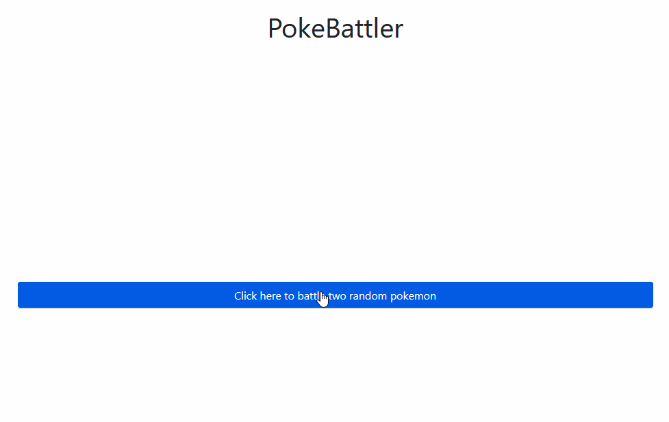
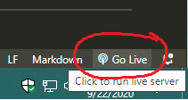

# PokeBattler
A website that battles two random pokemon head to head to see which will win. This project is in no way affiliated with Nintendo.

This is a free project for education purposes. It is open source under the [MIT license](LICENSE.md).

We use the pokemon API: https://pokeapi.co/

Current URL:
https://markim.github.io/pokebattler (subject to change)

----

----

## How to develop

- Download and install visual studio code - https://code.visualstudio.com/
- Clone the repo: `git clone git@github.com:markim/PokeBattler.git`
- Go into repo directory: `cd PokeBattler`
- Open the folder in VSCode: `code .`
- Download the `Live Server` extension in VSCode (search extensions for `ritwickdey.liveserver`)
- Click the `Go Live` button to open a browser with the site

----

## Features
- Start a battle between two random pokemon (currently between pokemon 1 - 151)
- See who is the winner based on which pokemon has the higher attack statistic

----

## Future plans and ideas
- Add more customizable battles
  - Choose generation
  - Specify pokemons based on type
- Have more in-depth battles using moves and abilities
